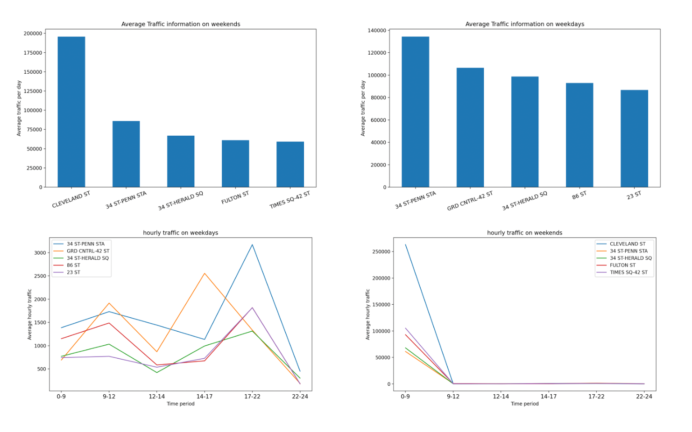

# MTA Analysis - Best Stations for Advertising

## Table of Contents
- [Abstract](#link-part-1)
- [Design](#link-part-2)
- [Data](#link-part-3)
- [Algorithm](#link-part-4)
- [Tools](#link-part-5)
- [Communication](#link-part-6)
- [How to run](#link-part-7)

## <a name="link-part-1">Abstract</a>

The goal of this project was to virtualize traffic information of different MTA
stations and give advertising suggestions. By analyzing the MTA dataset, I got
the traffic information of each station on weekdays and weekends, during each time
period. Based on the traffic information and each station's coordinate, I'm able
to virtualize the result for a more clear view and give suggestions.

## <a name="link-part-2">Design</a>

Company A wants to put out ads in some MTA stations from September to December.
They're advatising their brand new gaming laptops and desktops.

Gaming laptops are mostly targeting college students since most of them like and
have the time to play games. Desktops are targeting employees especially around IT
companies. The goal of this project was to analyze MTA dataset to give advertising
suggestions to the company.

Company A needs the traffic information and location of each station from last
summer to decide where and when to put out those ads.

## <a name="link-part-3">Data</a>

The MTA dataset I'm using contains 3099133 rows of data, which includes 344 stations
with their coordinates.

Each row will represent the number of entries and exits in each unit during weekdays
and weekends, mornings, afternoons and nights. In this way I can get which station is
busy during weekdays in the morning and which is during weekends at night and so on
which can be used to determine which ad goes to which station.

I also generated a dataset of 6 universities and 5 companies in New York City by myself,
which includes their names and coordinates.

## <a name="link-part-4">Algorithm</a>

1. Get dataset from MTA website.
2. Get rid of stations that aren't in the coordinate dataset.
3. Get each station's daily entries and exits for comparison.
4. Separate them into to categories: weekdays and weekends
5. Get top 5 stations for weekdays and weekends
6. Combine time into time periods and generate hourly entries and exits for each station.
7. Generate graphs and maps

## <a name="link-part-5">Tools</a>

* SQLite database system
* Pandas for data manipulation
* Matplotlib for plotting
* Folium for generating maps

## <a name="link-part-6">Communication</a>



The project proposal is shown [here](/proposal.md).

Slides for this project is shown [here](/slides.pdf).

## <a name="link-part-7">How to run</a>

Get MTA data by
```
python get_mta.py "(2109|2110|2111|2112)"
```

Run [final_project](/final_project.ipynb) in Jupyter Notebook
